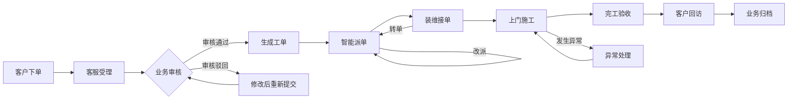

# BBPMS 业务流程可视化创新方案

## 1. 建设目标

本方案面向宽带业务流程管理系统（BBPMS），目标不是简单地将业务状态绘制成静态流程图，而是构建一套“可追踪、可回放、可预测、可干预”的业务流程数字孪生界面。

系统应当帮助不同角色快速回答以下问题：

- 一笔订单目前走到了哪里？
- 当前节点由谁负责？
- 为什么会停留在当前节点？
- 哪些业务即将超时或已经出现异常？
- 自动派单为什么选择当前装维人员？
- 如果调整人员或派单策略，业务效率会发生什么变化？

## 2. 整体设计理念

业务可视化采用“全局态势—单笔追踪—决策解释”三级视角：

1. 全局态势：展示全部订单和工单在各业务节点的分布、流量、积压及 SLA 风险。
2. 单笔追踪：展示单笔订单从创建到归档的完整业务轨迹和人员操作轨迹。
3. 决策解释：展示派单、改派、转单和异常干预的依据以及可能产生的影响。

## 3. 创新方案一：业务流程地铁图

### 3.1 核心思路

将宽带订单生命周期设计为地铁线路：业务节点是“站点”，状态流转是“线路”，驳回、改派、转单及异常处理是分支线路或回环线路。



### 3.2 可视化编码

- 节点大小：表示该节点当前积压的业务数量。
- 线路宽度：表示单位时间内的业务流转量。
- 节点颜色：绿色表示正常，黄色表示临近 SLA，红色表示超时或异常。
- 流动粒子：表示订单正在从一个节点流向另一个节点。
- 脉冲效果：表示短时间内异常数量快速增长。
- 虚线线路：表示尚未发生但系统预测可能经过的流程。

### 3.3 交互方式

- 点击节点，打开处于该状态的订单或工单列表。
- 悬停节点，显示业务数量、平均停留时间、超时数量和转化率。
- 点击线路，查看两个节点之间的平均流转时间和失败原因。
- 按区域、业务类型、时间范围或责任部门筛选流程数据。
- 根据当前用户权限，直接在节点详情中执行审核、派单、改派或催办操作。

### 3.4 业务价值

管理人员无需逐张查看报表，即可发现订单主要积压在哪个环节，并快速定位需要干预的流程节点。

## 4. 创新方案二：单笔业务双轨时间轴

### 4.1 核心思路

在订单或工单详情页同时展示两条彼此对齐的时间轨道：

- 业务状态轨：展示创建、审核、派单、接单、施工、完工、回访及归档等状态变化。
- 人员操作轨：展示客户、客服、调度员、装维人员和系统在对应时间执行的操作。

### 4.2 展示内容

- 状态变更前后的值。
- 操作时间和节点停留时长。
- 操作人、所属角色及所属部门。
- 审核意见、驳回原因、改派原因和异常备注。
- 相关附件、施工照片和客户评价。
- 下一节点预计到达时间和整体预计完工时间。

### 4.3 创新交互

- 点击业务事件时，高亮同一时间发生的人员操作。
- 将驳回、转单、改派显示为回环支线，避免与正常主流程混淆。
- 当前节点显示实时 SLA 倒计时。
- 未来预测节点采用半透明样式，实际完成后转换为实线节点。
- 对长时间无操作的区间直接显示“等待 2 小时 18 分钟”等停留信息。

### 4.4 业务价值

双轨时间轴能够明确区分“业务状态发生了什么”和“由谁进行了操作”，适合客服查询、问题排查、责任追踪和售后解释。

## 5. 创新方案三：流程回放时间机器

### 5.1 核心思路

为流程态势图增加时间滑块和播放控制，使用户能够恢复任意历史时刻的业务状态，并动态观察订单在流程中的流动过程。

### 5.2 主要功能

- 选择日期和时间，恢复当时各节点的订单数量。
- 按正常速度、加速或逐步方式播放流程变化。
- 对比两个时间段的业务效率。
- 查看异常和积压从何时开始形成。
- 回放一次投诉、系统故障或大面积超时事件的完整过程。
- 标注规则发布、人员排班调整等重要时间点。

### 5.3 典型场景

- 复盘某一天派单工作台为何出现大量待派工单。
- 比较派单算法调整前后的平均等待时长。
- 分析某个区域在装维人员请假后产生的负载变化。
- 向管理人员演示业务高峰期间的全流程变化。

## 6. 创新方案四：流程 X 光与瓶颈热力模式

### 6.1 核心思路

在正常流程图基础上提供“X 光模式”，将业务数量、等待时间、异常比例和 SLA 风险直接映射到流程节点与线路上。

### 6.2 可视化表现

- 绿色节点：业务运行正常。
- 黄色节点：接近 SLA 阈值。
- 红色节点：已超时或异常比例较高。
- 节点越大：积压业务越多。
- 颜色越深：平均等待时间越长。
- 线路越粗：业务流量越大。
- 红色脉冲：异常数量正在快速增长。

### 6.3 自动诊断文案

系统不应只展示红色节点，还应生成可以直接执行的诊断信息，例如：

> 派单环节当前积压 18 张工单，平均等待 42 分钟。主要原因是城北片区在岗装维人员不足，建议跨片区调度或提高该区域派单优先级。

### 6.4 下钻分析

点击异常节点后，展示：

- 受影响订单和工单。
- 超时原因分布。
- 责任区域及责任角色。
- 最早异常发生时间。
- 建议执行的处理动作。

## 7. 创新方案五：智能派单决策透视

### 7.1 核心思路

将自动派单由“黑盒结果”变为“可解释的调度决策”，展示候选装维人员排名和各项评分依据。

### 7.2 候选人对比维度

- 当前在岗状态。
- 当前工单负载。
- 与客户地址的距离。
- 技能和业务类型匹配程度。
- 历史完工时长。
- 客户历史评价。
- 是否请假或存在时间冲突。
- 预计到达时间。
- 预计超时风险。

### 7.3 推荐结果展示

系统可使用分解条、雷达图或贡献度排序展示派单原因，例如：

> 推荐张伟：距离得分 32%，负载得分 28%，技能匹配 25%，服务评价 15%。预计 28 分钟到达，当前同时处理 2 张工单。

### 7.4 人工干预

- 调度员可以查看前若干名候选人并手动选择。
- 手动选择与系统推荐不一致时，记录干预原因。
- 后续将实际完成结果与当时的推荐结果对比，用于优化派单规则。

## 8. 创新方案六：流程预测与风险幽灵节点

### 8.1 核心思路

在真实流程之后增加半透明的“幽灵节点”，展示系统预测的下一状态、预计完成时间和可能发生的异常。

### 8.2 预测信息

- 下一步最可能进入的流程节点。
- 预计接单、到达和完工时间。
- SLA 超时概率。
- 驳回、改派或转单概率。
- 当前风险的主要影响因素。
- 建议提前执行的干预措施。

### 8.3 示例

> 工单 WO202609050018 有 78% 概率超过 4 小时 SLA。主要影响因素为装维人员当前负载过高，建议改派给同片区的李强。

### 8.4 展示原则

- 预测节点必须与真实节点在视觉上明确区分。
- 所有预测信息应标明更新时间和置信程度。
- 系统建议只作为辅助决策，重要操作仍需有权限的人员确认。

## 9. 创新方案七：业务流程调度沙盘

### 9.1 核心思路

提供“如果……会怎样”的模拟能力，让调度员在不改变真实业务数据的情况下调整参数，预览可能产生的业务影响。

### 9.2 可调参数

- 增加或减少某区域的在岗装维人员。
- 调整最大同时处理工单数。
- 调整距离、负载、评分和技能的派单权重。
- 修改 SLA 阈值。
- 模拟部分人员请假或某区域业务量突增。

### 9.3 模拟结果

- 待派工单数量变化。
- 平均派单和完工时长变化。
- 超时率变化。
- 不同装维人员的负载变化。
- 受影响最大的业务区域。

### 9.4 安全边界

沙盘数据必须与真实数据隔离。模拟结束后，只有在用户明确确认且具备对应权限时，才允许将策略参数应用到生产规则。

## 10. 分角色可视化设计

### 10.1 管理员和管理人员

- 查看全局业务流程地铁图。
- 查看区域、部门和时间维度的瓶颈热力图。
- 使用流程回放进行异常复盘。
- 查看整体 SLA、转化率和流程效率。

### 10.2 客服人员

- 查看订单受理、审核、驳回和重新提交节点。
- 使用双轨时间轴解释客户订单进度。
- 快速识别等待客户补充资料的订单。
- 从异常节点直接执行催办或沟通记录操作。

### 10.3 调度人员

- 查看待派工单池和装维人员负载。
- 查看智能派单决策透视。
- 在地图、流程和人员负载之间联动选择。
- 对超时风险工单执行改派或跨区域调度。

### 10.4 装维人员

- 查看个人任务时间线和推荐执行顺序。
- 查看每张工单的 SLA 剩余时间。
- 查看客户位置、预计路程及任务依赖关系。
- 上报异常后查看工单重新进入的处理流程。

### 10.5 客户

客户门户应采用简化的物流式进度展示，避免暴露复杂内部状态：

```text
已提交 → 已受理 → 已安排工程师 → 工程师上门中 → 已完成
```

同时显示预约时间、装维人员基本信息、当前服务进度及可执行的联系、改约和评价操作。

## 11. 推荐页面布局

### 11.1 业务流程驾驶舱

- 顶部：时间、区域和业务类型筛选器。
- 中部：业务流程地铁图，作为页面主体。
- 右侧：异常业务和风险预警列表。
- 底部：流程节点趋势及历史时间滑块。
- 点击节点：打开抽屉查看对应业务清单和处理建议。

### 11.2 订单详情页

- 顶部：订单基本信息、当前状态及 SLA 倒计时。
- 中部：业务状态轨和人员操作轨。
- 下部：相关工单、附件、异常记录和预测信息。
- 右侧操作区：只展示当前状态和当前权限允许的操作。

### 11.3 派单工作台

- 左侧：待派工单列表。
- 中部：工单位置及候选装维人员地图。
- 右侧：候选人排名和派单依据。
- 底部：区域负载、预计到达时间和 SLA 风险。

## 12. 数据支撑建议

为了支持上述可视化，后端应提供统一的业务事件数据。建议每条事件至少包含：

- 业务类型。
- 订单 ID 和工单 ID。
- 事件类型。
- 变更前状态和变更后状态。
- 操作人 ID、名称及角色。
- 事件发生时间。
- 节点停留时长。
- 操作原因和备注。
- 所属区域及部门。
- 业务版本号或时间线序号。

聚合接口应支持按时间、区域、业务类型、状态和角色查询节点数量、平均耗时、超时率及流转量。

## 13. 动效与可用性原则

- 动画只用于表达真实的状态变化、实时流转和异常提醒。
- 避免持续闪烁、大面积渐变和过度装饰影响日常操作。
- 颜色必须同时配合文字、图标或形状，不能只依赖颜色表达状态。
- 流程节点必须支持键盘操作，并为关键图形提供文本说明。
- 移动端优先展示单笔业务进度，全局复杂流程图可降级为纵向步骤条。
- 所有直接改变业务状态的操作必须进行权限校验和必要确认。

## 14. 分阶段落地建议

### 第一阶段：核心可视化

- 实现业务流程地铁图。
- 实现订单详情双轨时间轴。
- 展示各节点业务数量、平均停留时间和 SLA 状态。
- 支持点击节点筛选订单或工单。
- 实现基于权限的节点快捷操作。

### 第二阶段：诊断和解释

- 增加流程 X 光和瓶颈热力模式。
- 增加智能派单决策透视。
- 增加异常诊断文案和处理建议。
- 实现流程回放时间机器。

### 第三阶段：预测和模拟

- 增加流程风险预测。
- 增加预计完成时间和幽灵节点。
- 建设业务流程调度沙盘。
- 将实际结果反馈到派单和预测模型中。

## 15. 推荐优先方案

综合创新程度、业务价值和实现成本，建议优先采用以下组合：

1. 首页使用“业务流程地铁图”，展示全局业务流转情况。
2. 订单详情使用“双轨时间轴”，展示状态变化和人员操作。
3. 派单工作台使用“决策透视”，解释推荐装维人员的依据。
4. 使用节点颜色、大小和线路宽度表达 SLA、积压及业务流量。
5. 第二阶段加入“流程回放”和“风险预测”，形成完整的业务流程数字孪生能力。

该组合既能提升系统展示效果，也能直接支持客服查询、调度决策、异常处理和管理分析，避免可视化成为与实际业务操作脱节的装饰性页面。
